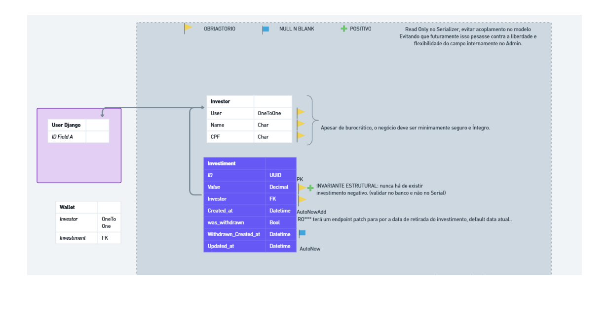

# API de Investimentos

Esta documentação descreve a API de **Investimentos**, responsável por criar investimentos, calcular ganhos e realizar o resgate (withdrawal) de forma segura e consistente.


A API foi desenhada seguindo boas práticas de **Django Rest Framework**, separando claramente:

- **Model** → persistência e estado
- **Serializer** → validação e contrato da API
- **Business (Service Layer)** → regras de negócio e cálculos financeiros
- **Views** → orquestração HTTP
- **Services** → Conexões externas
- **Signals** → Gatilhos
- **Business Tests** → Teste da Camada de negócio.

---

## 📌 Princípios adotados

- Cálculos financeiros feitos **exclusivamente com `Decimal`**
- Arredondamento explícito (`ROUND_HALF_EVEN`)
- Uso de **timezone-aware datetimes** (`django.utils.timezone`)
- Regra de negócio fora do serializer (Service Layer)
- Serializers responsáveis apenas por:
  - validação
  - transformação de dados
- Endpoints idempotentes e previsíveis

---

## 🧩 Modelo: Investiment

Representa um investimento financeiro único.

### Campos principais

| Campo | Tipo | Descrição |
|------|------|-----------|
| `id` | UUID | Identificador único do investimento |
| `value` | Decimal | Valor inicial investido (mínimo R$ 0,01) |
| `investor` | FK (`Investor`) | Investidor associado ao investimento |
| `was_withdrawn` | Boolean | Indica se o investimento já foi resgatado |
| `withdrawn_created_at` | DateTime (nullable) | Data em que o resgate do investimento foi registrado |
| `created_at` | DateTime | Data de criação do investimento (pode ser passada) |
| `updated_at` | DateTime | Data da última atualização do registro |

---

## 💼 Modelo: Investor

Representa um investidor registrado no sistema. Cada investidor está associado a um usuário do Django e possui CPF para identificação.

### Campos principais

| Campo | Tipo | Descrição |
|-------|------|-----------|
| `id` | ID | Identificador único do investidor |
| `user` | OneToOneField (User) | Usuário do Django associado ao investidor. Garante relação 1:1 e protege contra deleção acidental. |
| `name` | CharField | Nome completo do investidor |
| `cpf` | CharField | CPF do investidor, utilizado para identificação fiscal no Brasil |

---

## 🧠 Camada de Negócio (Service Layer)

Classe responsável **exclusivamente** pelos cálculos financeiros:

- Juros compostos mensais
- Saldo esperado
- Ganhos líquidos (com tributação)
- Cálculo baseado em delta de meses

### Taxa utilizada

```python
MONTHLY_RATE = Decimal('0.0052')  # 0.52% a.m.
```

### Métodos disponíveis

| Método | Descrição |
|------|----------|
| `calculate_amount()` | Montante atual (valor + juros) |
| `calculate_gains()` | Ganhos brutos atuais |
| `calculate_amount_withdrawn()` | Montante bruto no momento do saque |
| `calculate_gains_withdrawn()` | Ganhos brutos no saque |
| `calculate_net_amount_withdrawn()` | Montante líquido após imposto |
| `calculate_net_gains_withdrawn()` | Ganhos líquidos após imposto |

📌 **Observação:**
Todos os retornos são `Decimal` já arredondados para 2 casas decimais.

---
## 🔁 Serializers

### 📄 InvestimentListSerializer

Usado no **GET /investiments/**

Responsável por expor uma visão consolidada do investimento.

#### Campos retornados

| Campo | Descrição |
|------|----------|
| `value` | Valor investido |
| `gains` | Ganhos (atuais ou no saque) |
| `balance_amount` | Saldo total esperado |
| `created_at` | Data de criação |
| `was_withdrawn` | Status do investimento |
| `withdrawn_created_at` | Data do saque (se existir) |

📌 **Regra importante:**
- Se o investimento **não foi sacado**, os valores refletem o estado atual
- Se **já foi sacado**, os valores refletem o estado no momento do saque

---

### ➕ InvestimentCreateSerializer

Usado no **POST /investiments/**

#### Validações

- `created_at` não pode ser uma data futura

```python
if value > timezone.now():
    raise ValidationError('Data futura não é permitida')
```

---

### 💸 InvestimentWithdrawnSerializer

Usado no **PATCH /investiments/{id}/withdrawn/**

Responsável por realizar o resgate do investimento.

#### Regras de validação

- O investimento **não pode** já ter sido resgatado
- A data de saque:
  - não pode ser futura
  - não pode ser anterior à criação
- Caso nenhuma data seja informada, o sistema utiliza `timezone.now()`

#### Comportamento do update

- Define `withdrawn_created_at`
- Marca `was_withdrawn = True`
- Retorna o **valor líquido do saque**

---

## 🌐 Endpoints

### 🔍 Listar investimentos

```http
GET /api/v1/investiments/
```

#### Exemplo de resposta

```json
{
  "id": "uuid",
  "value": "1213.00",
  "gains": 6.31,
  "balance_amount": 1219.31,
  "was_withdrawn": false
}
```

---

### ➕ Criar investimento

```http
POST /api/v1/investiments/
```

```json
{
  "investor": "uuid",
  "value": "1200.00",
  "created_at": "2025-11-12T01:00:00-03:00"
}
```

---

### 💸 Resgatar investimento

```http
PATCH /api/v1/investiments/{id}/withdrawn/
```

```json
{
  "withdrawn_created_at": "2025-12-16T14:54:44-03:00"
}
```

📌 O campo é opcional. Se omitido, o backend usa o horário atual.

#### Resposta

```json
{
  "id": "uuid",
  "was_withdrawn": true,
  "withdrawal_amount": 1217.89,
  "withdrawn_created_at": "2025-12-16T14:54:44-03:00"
}
```

---

## 👤 Usuários & Investidores

### 🧑‍💻 Usuário

```http
POST /api/v1/users/register/
```
Corpo da requisição
```json
{
  "username": "johndoe",
  "email": "john@example.com",
  "password": "strong_password_123"
}
```
Resposta de exemplo:
```json
{
  "id": 1,
  "username": "johndoe",
  "email": "john@example.com"
}

```

```http
GET /api/v1/users/register/
```

Listar usuários Django

```json
[
    {
        "id": 1,
        "username": "johndoe",
        "email": "john@example.com"
    }
]
```

### 🧑💸 Investidor


```http
GET /api/v1/investors/
```

```json
[
  {
    "id": 1,
    "user": 1,
    "name": "João Silva"
  }
]

```

➕ Criar investidor

```http
POST /api/v1/investors/
```
Corpo da Request
```json
{
  "user": 1,
  "name": "João Silva"
}
```

Exemplo de Resposta
```json
{
  "id": 1,
  "user": 1,
  "name": "João Silva"
}
```
Detalhar um Investidor:
```http
GET /api/v1/investors/{id}/
```
```json
{
  "id": 1,
  "user": 1,
  "name": "João Silva"
}
```
Deletar um Investidor:
```http
Delete /api/v1/investors/{id}/
```
**!Banco de Dados integro por padrão, verficiar On_delete no model**
Obs: Coloquei nessa Api, mas normalmente, se não há necessidade, trabalho sem Deletes,
em tabelas de registro isso é obrigatório, tal motivo usei uma flag em investimentos. 👍

---

## ⏱️ Datas e Fuso Horário

- Toda a aplicação utiliza **timezone-aware datetimes**
- O Django gerencia conversões automaticamente
- Cálculos mensais usam apenas a **parte da data** (`date()`), evitando erros de fuso

---

---
*Modelagem De Dados* Desenvolvida para funcionamento da API

*wallet foi uma ideia futura para armazenamento desses saldos investidos.
---

## 💡 Considerações finais

- O backend é a **fonte da verdade** para cálculos financeiros
- O frontend consome valores já tratados e arredondados
- Conversão para `float` no JSON **não afeta os cálculos**, pois eles já foram finalizados

Este design garante:

✅ Precisão financeira
✅ Clareza de responsabilidades
✅ Facilidade de manutenção
✅ Segurança nas regras de negócio

Arquitetura MVT baseada no atendimento aos requisitos pedidos e a proposta do Framework Django.